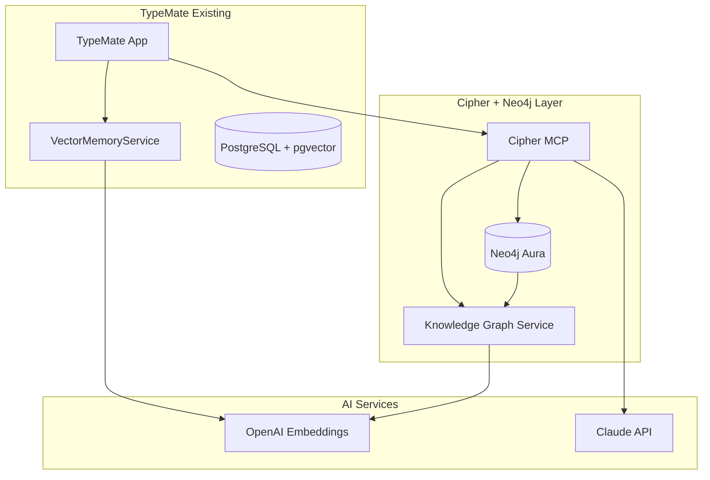

# 🎵 Cipher + Neo4j + OpenAI Embeddings 統合設計書
## TypeMate知識管理システム次世代アーキテクチャ

### 🎯 統合ビジョン
**AIの記憶系を司る開発知識管理システム**  
TypeMateのベクトル検索成功体験 × Neo4j グラフデータベース × Cipher MCP統合

---

## 🏗️ システムアーキテクチャ概要



---

## 🔗 Phase 1: ハイブリッドアーキテクチャ設計

### 既存システムとの共存戦略
```typescript
// 🎵 統合知識管理サービス
export class CipherKnowledgeManager {
  constructor(
    private vectorMemoryService: VectorMemoryService,  // 既存TypeMate
    private neo4jService: Neo4jGraphService,           // 新規Cipher
    private openaiService: OpenAI                      // 共通
  ) {}

  // ハイブリッド検索: PostgreSQL Vector + Neo4j Graph
  async searchKnowledge(
    query: string,
    options: {
      useTypeMateMirror?: boolean;  // TypeMate記憶も検索
      useGraphContext?: boolean;    // 関係性考慮
      domain?: string[];            // 知識ドメイン絞り込み
    }
  ): Promise<HybridKnowledgeResult> {
    // 1. OpenAI Embeddings生成 (既存活用)
    const embedding = await this.vectorMemoryService.generateEmbedding(query);
    
    // 2. Neo4j ベクトル + グラフ検索
    const graphResults = await this.searchNeo4jKnowledge(embedding, options);
    
    // 3. TypeMate記憶検索 (オプション)
    let typemateResults = [];
    if (options.useTypeMateMirror) {
      typemateResults = await this.vectorMemoryService.searchSimilarMemories(
        query, userId, { limit: 5 }
      );
    }
    
    // 4. 結果統合とランキング
    return this.mergeAndRankResults(graphResults, typemateResults);
  }
}
```

### データフロー設計
```yaml
# 🎵 知識投入フロー
Knowledge Ingestion:
  1. Source Detection:
     - TypeMate Codebase Analysis
     - Documentation Parsing  
     - Conversation Memory Analysis
  
  2. Embedding Generation:
     - OpenAI text-embedding-3-small
     - Batch Processing (50 chunks)
     - Cache for Reuse
  
  3. Graph Construction:
     - Node Creation (Project, Feature, Concept)
     - Relationship Mapping (HAS_FEATURE, IMPLEMENTS, etc.)
     - Vector Index Assignment
  
  4. Validation:
     - Schema Compliance
     - Relationship Integrity
     - Vector Quality Check
```

---

## 🔍 Phase 2: Neo4j グラフスキーマ設計

### TypeMate知識体系モデリング
```cypher
// 🎵 TypeMate Knowledge Graph Schema

// === Core Entities ===
CREATE CONSTRAINT project_unique IF NOT EXISTS FOR (p:Project) REQUIRE p.name IS UNIQUE;
CREATE CONSTRAINT feature_unique IF NOT EXISTS FOR (f:Feature) REQUIRE f.name IS UNIQUE;
CREATE CONSTRAINT concept_unique IF NOT EXISTS FOR (c:Concept) REQUIRE c.name IS UNIQUE;

// === Vector Indexes ===
CREATE VECTOR INDEX project_embeddings IF NOT EXISTS
FOR (p:Project) ON (p.embedding)
OPTIONS {
  indexConfig: {
    `vector.dimensions`: 1536,
    `vector.similarity_function`: 'cosine'
  }
};

CREATE VECTOR INDEX feature_embeddings IF NOT EXISTS
FOR (f:Feature) ON (f.embedding)
OPTIONS {
  indexConfig: {
    `vector.dimensions`: 1536,
    `vector.similarity_function`: 'cosine'
  }
};

// === Knowledge Domains ===
(:Project {name: "TypeMate"})
  -[:HAS_FEATURE]-> (:Feature {name: "Vector Search"})
  -[:HAS_FEATURE]-> (:Feature {name: "Memory Management"})
  -[:HAS_FEATURE]-> (:Feature {name: "AI Personalities"})
  -[:HAS_FEATURE]-> (:Feature {name: "Supabase Integration"})

(:Feature {name: "Vector Search"})
  -[:IMPLEMENTS]-> (:Concept {name: "OpenAI Embeddings"})
  -[:IMPLEMENTS]-> (:Concept {name: "pgvector"})
  -[:IMPLEMENTS]-> (:Concept {name: "Cosine Similarity"})
  -[:TESTED_BY]-> (:Test {name: "Vector Search Integration Test"})

(:Concept {name: "OpenAI Embeddings"})
  -[:USES_MODEL]-> (:Model {name: "text-embedding-3-small"})
  -[:HAS_DIMENSION]-> (:Dimension {value: 1536})
```

### 関係性定義
```cypher
// 🎵 Relationship Types
CREATE (project)-[:HAS_FEATURE]->(feature)
CREATE (feature)-[:IMPLEMENTS]->(concept)
CREATE (feature)-[:DEPENDS_ON]->(dependency)
CREATE (feature)-[:TESTED_BY]->(test)
CREATE (concept)-[:RELATED_TO]->(related_concept)
CREATE (implementation)-[:DOCUMENTS]->(documentation)
CREATE (problem)-[:SOLVED_BY]->(solution)
CREATE (version)-[:SUCCEEDS]->(previous_version)
```

---

## 🧠 Phase 3: 知識投入・更新戦略

### TypeMate既存知識の自動抽出
```typescript
// 🎵 TypeMate Knowledge Extractor
export class TypeMateKnowledgeExtractor {
  async extractProjectKnowledge(): Promise<KnowledgeGraph> {
    const knowledge = new KnowledgeGraph();
    
    // 1. コードベース解析
    const codeAnalysis = await this.analyzeCodebase([
      'src/lib/vector-memory-service.ts',
      'src/lib/memory-manager.ts',
      'src/app/chat/page.tsx'
    ]);
    
    // 2. ドキュメント解析
    const docAnalysis = await this.analyzeDocs([
      'docs/VECTOR_SEARCH_SETUP.md',
      'VECTOR_TEST_REPORT.md'
    ]);
    
    // 3. 設定解析
    const configAnalysis = await this.analyzeConfig([
      'package.json',
      '.env.local',
      'next.config.js'
    ]);
    
    // 4. 知識グラフ構築
    return this.buildKnowledgeGraph({
      code: codeAnalysis,
      docs: docAnalysis,
      config: configAnalysis
    });
  }
  
  private async analyzeCodebase(files: string[]): Promise<CodeKnowledge[]> {
    const results = [];
    
    for (const file of files) {
      const content = await fs.readFile(file, 'utf8');
      const embedding = await this.generateEmbedding(content);
      
      results.push({
        file,
        type: 'implementation',
        concepts: this.extractConcepts(content),
        dependencies: this.extractDependencies(content),
        embedding
      });
    }
    
    return results;
  }
}
```

### 段階的知識投入プロセス
```yaml
# 🎵 Knowledge Ingestion Phases

Phase 1 - Foundation (30秒達成感):
  - TypeMate Project Node作成
  - 主要Feature識別
  - 基本関係性マッピング
  
Phase 2 - Implementation (5分達成感):
  - コード解析による詳細概念抽出
  - 依存関係グラフ構築
  - テスト・ドキュメント関連付け
  
Phase 3 - Optimization (1時間達成感):
  - ベクトル検索統合
  - 類似性計算最適化
  - パフォーマンス監視導入
```

---

## 🔗 Phase 4: Cipher MCP統合

### MCP Server Configuration
```yaml
# ~/.cipher/config.yml (完全版)
mcps:
  neo4j-typemate-knowledge:
    command: "node"
    args: ["./cipher-servers/neo4j-knowledge-server.js"]
    env:
      NEO4J_URI: ${NEO4J_URI}
      NEO4J_USERNAME: ${NEO4J_USERNAME}
      NEO4J_PASSWORD: ${NEO4J_PASSWORD}
      OPENAI_API_KEY: ${OPENAI_API_KEY}
      TYPEMATE_PROJECT_ROOT: ${TYPEMATE_PROJECT_ROOT}
  
  typemate-memory-bridge:
    command: "node"
    args: ["./cipher-servers/typemate-bridge-server.js"]
    env:
      SUPABASE_URL: ${SUPABASE_URL}
      SUPABASE_ANON_KEY: ${SUPABASE_ANON_KEY}
      OPENAI_API_KEY: ${OPENAI_API_KEY}

# Knowledge Management Settings
knowledge:
  domains:
    vector_search:
      priority: high
      auto_update: true
    memory_management:
      priority: high
      auto_update: true
    ai_personalities:
      priority: medium
      auto_update: false
  
  embedding:
    model: "text-embedding-3-small"
    dimensions: 1536
    batch_size: 50
    cache_ttl: 3600
```

### Custom MCP Server実装
```typescript
// cipher-servers/neo4j-knowledge-server.js
import { Server } from '@modelcontextprotocol/sdk/server/index.js';
import { StdioServerTransport } from '@modelcontextprotocol/sdk/server/stdio.js';
import neo4j from 'neo4j-driver';

const server = new Server(
  {
    name: "neo4j-typemate-knowledge",
    version: "1.0.0",
  },
  {
    capabilities: {
      resources: {},
      tools: {},
    },
  }
);

// Neo4j Driver Setup
const driver = neo4j.driver(
  process.env.NEO4J_URI,
  neo4j.auth.basic(process.env.NEO4J_USERNAME, process.env.NEO4J_PASSWORD)
);

// Knowledge Search Tool
server.setRequestHandler("tools/list", async () => {
  return {
    tools: [
      {
        name: "search_typemate_knowledge",
        description: "TypeMate開発知識をグラフベースで検索",
        inputSchema: {
          type: "object",
          properties: {
            query: { type: "string" },
            domain: { type: "string", enum: ["vector_search", "memory_management", "ai_personalities"] },
            include_context: { type: "boolean", default: true }
          },
          required: ["query"]
        }
      },
      {
        name: "get_implementation_details",
        description: "特定機能の実装詳細を取得",
        inputSchema: {
          type: "object",
          properties: {
            feature_name: { type: "string" },
            include_code: { type: "boolean", default: false }
          },
          required: ["feature_name"]
        }
      }
    ]
  };
});

// Tool Execution Handler
server.setRequestHandler("tools/call", async (request) => {
  if (request.params.name === "search_typemate_knowledge") {
    return await searchTypeMateKnowledge(request.params.arguments);
  }
  
  if (request.params.name === "get_implementation_details") {
    return await getImplementationDetails(request.params.arguments);
  }
  
  throw new Error(`Unknown tool: ${request.params.name}`);
});

async function searchTypeMateKnowledge({ query, domain, include_context }) {
  const session = driver.session();
  
  try {
    // Vector + Graph hybrid search
    const cypher = `
      CALL db.index.vector.queryNodes('feature_embeddings', 5, $queryEmbedding)
      YIELD node, score
      MATCH (node)-[r]-(related)
      WHERE ($domain IS NULL OR node.domain = $domain)
      RETURN node, score, collect(related) as context
      ORDER BY score DESC
    `;
    
    const queryEmbedding = await generateEmbedding(query);
    const result = await session.run(cypher, { queryEmbedding, domain });
    
    return {
      content: [{
        type: "text",
        text: formatKnowledgeResults(result.records)
      }]
    };
  } finally {
    await session.close();
  }
}

// Start server
const transport = new StdioServerTransport();
server.connect(transport);
```

---

## 🎯 Phase 5: ユーザー体験設計

### 自然言語クエリ例
```typescript
// 🎵 Cipher統合後の質問・回答例

// Quality: "TypeMateのベクトル検索実装方法は？"
// Response: 
{
  implementation: {
    files: ["src/lib/vector-memory-service.ts", "src/lib/memory-manager.ts"],
    key_concepts: ["OpenAI text-embedding-3-small", "pgvector", "非同期ベクトル化"],
    dependencies: ["openai@5.10.1", "pgvector@0.2.1"],
    test_results: "100% success (5/5 tests)",
    documentation: "docs/VECTOR_SEARCH_SETUP.md"
  },
  relationships: {
    integrates_with: ["MemoryManager", "Supabase PostgreSQL"],
    tested_by: ["src/pages/api/test-vector.ts"],
    documented_in: ["VECTOR_TEST_REPORT.md"]
  }
}

// Query: "パフォーマンス最適化の次のステップは？"
// Response:
{
  current_optimizations: ["非同期ベクトル化", "HNSW インデックス", "エラー耐性"],
  next_steps: [
    "Redis キャッシュ導入",
    "Bundle 最適化",
    "Dynamic imports",
    "Component memo化"
  ],
  related_memory: "typemate-stage4-performance-optimization",
  estimated_impact: "30-50% 初期表示速度向上"
}
```

### ENFPサポート機能
```yaml
# 🎵 段階的達成感システム

30秒達成感:
  - 即座の知識検索応答
  - 関連コンセプトの視覚的表示
  - "今すぐできること"の提示

5分達成感:
  - 実装パスの自動生成
  - コード例の提供
  - テスト手順の明示

1時間達成感:
  - プロジェクト全体の最適化提案
  - 長期的アーキテクチャ計画
  - 美しいグラフ可視化
```

---

## 📊 Phase 6: パフォーマンス & モニタリング

### クエリパフォーマンス最適化
```cypher
-- 🎵 高速化Cypher クエリパターン

-- Pattern 1: Vector + Graph Hybrid
CALL db.index.vector.queryNodes('knowledge_embeddings', 10, $embedding)
YIELD node, score
WHERE score > 0.8
MATCH (node)-[:RELATES_TO*1..2]-(related)
RETURN node, score, collect(DISTINCT related) as context
ORDER BY score DESC
LIMIT 5;

-- Pattern 2: Domain-Specific Search
MATCH (p:Project {name: "TypeMate"})-[:HAS_FEATURE]->(f:Feature)
WHERE f.domain = $domain
CALL db.index.vector.queryNodes('feature_embeddings', 5, $embedding)
YIELD node, score
WHERE node = f
RETURN f, score, [(f)-[:IMPLEMENTS]->(c:Concept) | c] as concepts;
```

### 監視・アラート設定
```typescript
// 🎵 Performance Monitoring
export class CipherPerformanceMonitor {
  async monitorSystemHealth() {
    const metrics = {
      neo4j: await this.checkNeo4jHealth(),
      openai: await this.checkOpenAIUsage(),
      cipher: await this.checkCipherResponseTime(),
      typemate: await this.checkTypeMateIntegration()
    };
    
    // ENFPフレンドリーなダッシュボード
    return {
      overall_health: this.calculateOverallHealth(metrics),
      quick_wins: this.identifyQuickWins(metrics),
      long_term_optimizations: this.suggestLongTermOptimizations(metrics)
    };
  }
}
```

---

## 🚀 導入・運用計画

### マイグレーション戦略
```yaml
# 🎵 段階的導入計画

Week 1 - Foundation:
  - Neo4j Aura setup
  - Basic knowledge ingestion
  - Cipher MCP configuration

Week 2 - Integration:
  - TypeMate knowledge extraction
  - Vector search integration
  - Initial testing

Week 3 - Optimization:
  - Performance tuning
  - User experience refinement
  - Documentation completion

Week 4 - Launch:
  - Production deployment
  - Monitoring setup
  - Feedback collection
```

### 成功指標 (KPI)
```yaml
# 🎵 Success Metrics

Technical KPIs:
  - Query Response Time: < 500ms
  - Knowledge Coverage: 90%+ of TypeMate features
  - Search Accuracy: 85%+ relevant results

User Experience KPIs:
  - ENFP Satisfaction: 段階的達成感実現
  - Knowledge Discovery: 新しい関連性発見頻度
  - Development Velocity: 開発効率向上測定
```

---

## 🎉 期待される効果

### 🎵 音楽的開発体験
- **ハーモニー**: TypeMate既存機能との美しい調和
- **リズム**: 30秒→5分→1時間の段階的達成感
- **メロディー**: 直感的で流れるような知識発見体験

### 📈 具体的な改善
- **質問応答速度**: 従来の手作業検索から瞬時の応答へ
- **知識の関連性**: グラフによる予期しない関連性発見
- **開発効率**: 実装パターンの即座の参照と応用

**この設計により、TypeMateプロジェクトは単なるアプリケーションから、自己進化する知識生態系へと発展します！**